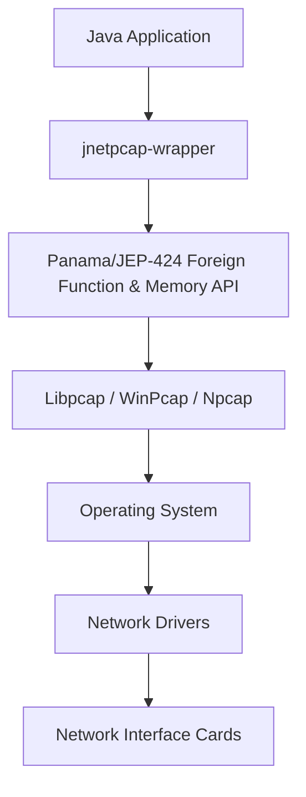

# jNetPcap Wrapper

Unlock Network Packet Analysis in Java with **jNetPcap Wrapper**.

**jNetPcap Wrapper** is a [*libpcap*][libpcap] Java library. This is the **version 2** release of the popular **jNetPcap** library, originally hosted on [*SourceForge.net*][sf.net].

---

## Table of Contents

1. [Overview](#overview)
2. [API Diagram](#api-diagram)
3. [Documentation](#documentation)
4. [Where are the protocols found in v1?](#where-are-the-protocols-found-in-v1)
5. [Examples](#examples)
   - [Capture a Live Packet](#capture-a-live-packet)
   - [Transmit a Packet With Data-Link Header](#transmit-a-packet-with-data-link-header)
   - [Statistics Snapshots](#statistics-snapshots)
   - [How To Run The Examples](#how-to-run-the-examples)
   - [For More Examples](#for-more-examples)
6. [Dependencies](#dependencies)
   - [Java Dependencies](#java-dependencies)
   - [Native Library Dependencies](#native-library-dependencies)
7. [Installation](#installation)
   - [Maven Artifact Config](#maven-artifact-config)
   - [Using Latest SNAPSHOT Releases](#using-latest-snapshot-releases)
   - [Download Release Package](#download-release-package)
   - [Compile From Source](#compile-from-source)
8. [Contact](#contact)
9. [Compatibility with jNetPcap Version 1](#compatibility-with-jnetpcap-version-1)
10. [Git Branches](#git-branches)
11. [Javadocs API Documentation](#javadocs-api-documentation)

---

## Overview

Harness the power of libpcap within your Java applications using jNetPcap Wrapper, a bridge granting seamless access to low-level network monitoring capabilities.

Key Features:

- **Capture and Analyze Network Traffic:** Real-time packet interception for detailed analysis.
- **Streamlined Integration:** Easily incorporate the library via Maven or manual classpath addition.
- **Intuitive Java API:** User-friendly Java interface for network data handling.
- **Packet Capture and Handling:** Utilize the `Pcap` class for interface monitoring and `PcapPacketHandler` for efficient packet processing.
- **Precise Packet Filtering:** Apply filters for targeted packet capture.

---

## API Diagram



---

## Documentation

- [Wiki pages][wiki]: Comprehensive user guides and examples.
- [Javadocs][javadocs]: Detailed API documentation.

---

## Where are the protocols found in v1?

Protocol support from version 1 is now part of [**jnetpcap-sdk**][jnetpcap-sdk], extending the basic wrapper's functionality.

---

## Examples

### Capture a Live Packet

```java
void main() throws PcapException {
    List<PcapIf> devices = Pcap.findAllDevs();
    try (Pcap pcap = Pcap.create(devices.get(0))) {
        pcap.activate();
        pcap.loop(1, (String msg, PcapHeader header, byte[] packet) -> {
            System.out.println(msg);
        }, "Capture Example");
    }
}
```

### Transmit a Packet With Data-Link Header

```java
void main() throws PcapException {
    String rawPacket = "0026622f4787...";
    byte[] packetBytes = PcapUtils.parseHexString(rawPacket);
    List<PcapIf> devices = Pcap.findAllDevs();
    try (Pcap pcap = Pcap.create(devices.get(0))) {
        pcap.activate();
        pcap.sendPacket(packetBytes);
    }
}
```

### Statistics Snapshots

```java
void main() throws PcapException, InterruptedException {
    List<PcapIf> devices = Pcap.findAllDevs();
    try (Pcap pcap = Pcap.create(devices.get(0))) {
        pcap.activate();
        for (int i = 0; i < 5; i++) {
            System.out.println(pcap.stats());
            Thread.sleep(1000);
        }
    }
}
```

### How To Run The Examples

#### Command-line Arguments:

- **Linux:** `-Djava.library.path=/usr/lib/... --enable-native-access=org.jnetpcap --enable-preview`
- **Windows:** `-Djava.library.path=C:\Windows\... --enable-native-access=org.jnetpcap --enable-preview`

---

## Dependencies

### Java Dependencies

No external dependencies apart from standard Java modules.

### Native Library Dependencies

Requires [*libpcap*][libpcap], [*Npcap*][npcap], or [*WinPcap*][winpcap].

---

## Installation

### Maven Artifact Config

Use the latest version variable in your `pom.xml` for easy updates:

```xml
<properties>
    <jnetpcap.version>LATEST</jnetpcap.version>
</properties>

<dependency>
    <groupId>com.slytechs.jnet.jnetpcap</groupId>
    <artifactId>jnetpcap-wrapper</artifactId>
    <version>${jnetpcap.version}</version>
</dependency>
```

### Using Latest SNAPSHOT Releases

Add this repository:

```xml
<repository>
    <id>sonatype-snapshots</id>
    <url>https://oss.sonatype.org/content/repositories/snapshots</url>
</repository>
```

### Download Release Package

Latest release: [download link][release]

---

## Contact

- Email: `sales@slytechs.com`

---

## Compatibility with jNetPcap Version 1

Details in the [Wiki][wiki].

---

## Git Branches

The project follows a structured branching strategy with support for multiple JDK versions:

- JDK 22+ development in `main` and `develop` branches
- JDK 21 LTS support in `jdk21/main` branch
- Feature, bugfix, hotfix, and backport branch prefixes for specific changes

For detailed information about our JDK version support strategy and LTS maintenance policy, please see our [Version Strategy Discussion](https://github.com/slytechs-repos/jnetpcap-wrapper/discussions/62).

## Javadocs API Documentation

The Javadocs are automatically generated and deployed to the `gh-pages` branch for easy reference. Access the [Javadocs here][javadocs]

---

[wiki]: https://github.com/slytechs-repos/jnetpcap/wiki
[javadocs]: https://slytechs-repos.github.io/jnetpcap-wrapper/org.jnetpcap/module-summary.html
[libpcap]: https://www.tcpdump.org/
[jnetpcap-sdk]: https://github.com/slytechs-repos/jnetpcap-sdk
[release]: https://github.com/slytechs-repos/jnetpcap/releases
[git-branch-model]: https://nvie.com/posts/a-successful-git-branching-model/

