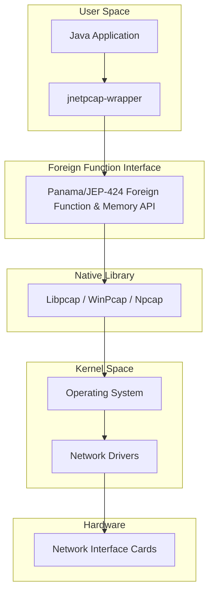

# jNetPcap Wrapper
Unlock Network Packet Analysis in Java with **jNetPcap Wrapper**

**jNetPcap Wrapper** is a [*libpcap*][libpcap] java library. This is **version 2** release of the popular **jNetPcap** library, previously hosted on [*SourceForge.net*][sf.net].

---

## Table of Contents
1. [Overview](#overview)
2. [API Diagram](#api-diagram)
3. [Documentation](#documentation)
4. [Where are the protocols found in v1?](#where-are-the-protocols-found-in-v1)
5. [Examples](#examples)
   1. [Capture a Live Packet](#capture-a-live-packet)
   2. [Transmit a Packet With Data-Link Header](#transmit-a-packet-with-data-link-header)
   3. [Statistics Snapshots](#statistics-snapshots)
   4. [How To Run The Examples](#how-to-run-the-examples)
   5. [For more examples](#for-more-examples)
6. [Dependencies](#dependencies)
   1. [Java Dependencies for Module: `org.jnetpcap`](#java-dependencies-for-module-orgjnetpcap)
   2. [Native Library Dependencies](#native-library-dependencies)
7. [Installation](#installation)
   1. [Maven Artifact Config](#maven-artifact-config)
   2. [Using latest SNAPSHOT releases](#using-latest-snapshot-releases)
   3. [Download Release Package](#download-release-package)
   4. [Compile From Source](#compile-from-source)
8. [Contact](#contact)
9. [Compatibility with jNetPcap version 1](#compatibility-with-jnetpcap-version-1)
10. [Git Branches](#git-branches)
11. [Javadocs API documentation](#java-javadocs)

---

## Overview
Harness the power of libpcap within your Java applications using jNetPcap Wrapper, a bridge that grants you seamless access to low-level network monitoring capabilities.

Key Features:

- Capture and Analyze Network Traffic
- Streamlined Integration
- Intuitive Java API
- Packet Capture and Handling
- Precise Packet Filtering

---

## API Diagram
This diagram illustrates the architecture of jnetpcap-wrapper and how it interacts with various components of the system.



---

## Documentation
- See [Wiki pages][wiki] for user guides and examples.
- See [Javadocs][javadocs] reference documentation.

---

## Where are the protocols found in v1?
If you are looking for protocol support, see [**jnetpcap-sdk**][jnetpcap-sdk].

---

## Examples

### Capture a Live Packet
```java
// Example Code Here
```

### Transmit a Packet With Data-Link Header
```java
// Example Code Here
```

### Statistics Snapshots
```java
// Example Code Here
```

### How To Run The Examples
Command-line arguments:
- Linux: `-Djava.library.path=/usr/lib/x86_64-linux-gnu --enable-native-access=org.jnetpcap --enable-preview`
- Windows: `-Djava.library.path=C:\Windows\SysWOW64 --enable-native-access=org.jnetpcap --enable-preview`

### For more examples
See the [wiki][wiki].

---

## Dependencies

### Java Dependencies for Module: `org.jnetpcap`
No external dependencies.

### Native Library Dependencies
Requires the native [*libpcap* library][libpcap].

---

## Installation

### Maven Artifact Config
```xml
<dependency>
    <groupId>com.slytechs.jnet.jnetpcap</groupId>
    <artifactId>jnetpcap-wrapper</artifactId>
    <version>X.Y.Z</version>
</dependency>
```

### Using latest SNAPSHOT releases
Add this repository:
```xml
<repository>
    <id>sonatype-snapshots</id>
    <url>https://oss.sonatype.org/content/repositories/snapshots</url>
</repository>
```

### Download Release Package
Latest release: [download link][release]

---

## Contact
- `sales@slytechs.com`

---

## Compatibility with jNetPcap version 1
Details in the [wiki][wiki].

---

## Git Branches
Follows a standard [branching model][git-branch-model].

---

## Java Javadocs
Javadocs are automatically generated and deployed to the `gh-pages` branch using Maven SCM.

[Javadocs][javadocs] are available online for easy reference.

---

[wiki]: https://github.com/slytechs-repos/jnetpcap/wiki
[javadocs]: https://slytechs-repos.github.io/jnetpcap-wrapper/org.jnetpcap/module-summary.html
[libpcap]: https://www.tcpdump.org/
[jnetpcap-sdk]: https://github.com/slytechs-repos/jnetpcap-sdk
[release]: https://github.com/slytechs-repos/jnetpcap/releases
[git-branch-model]: https://nvie.com/posts/a-successful-git-branching-model/
